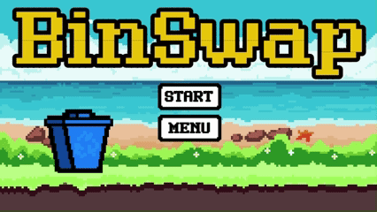
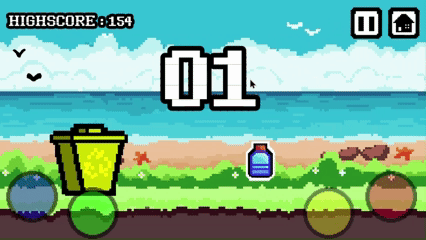

# 🗑️ BinSwap

BinSwap is an **endless runner** game where the player must swap the dustbin's color to match incoming waste items using four different colored buttons.  

---

## 🎮 Game Mechanics
- The player moves endlessly while **waste items are generated** in front of them.
- Four colored buttons are available to **change the bin's color** instantly.

- **Choosing the wrong color** for the incoming waste will immediately end the game.

---

## ⚠️ Disclaimer
This was the **first time** me and my friend undertook a project of a slightly larger scale than what we were used to.  
We acknowledge that:
- **Best coding practices were not always followed**  
- The code is **messy**   
- **Many features are yet to be implemented**  

The game was made specifically for a competition on waste segregation, and we had to **prioritize the core features** needed to present the game on that day. Future updates will aim to polish and expand the experience.

---

- Built using **Godot Engine**
